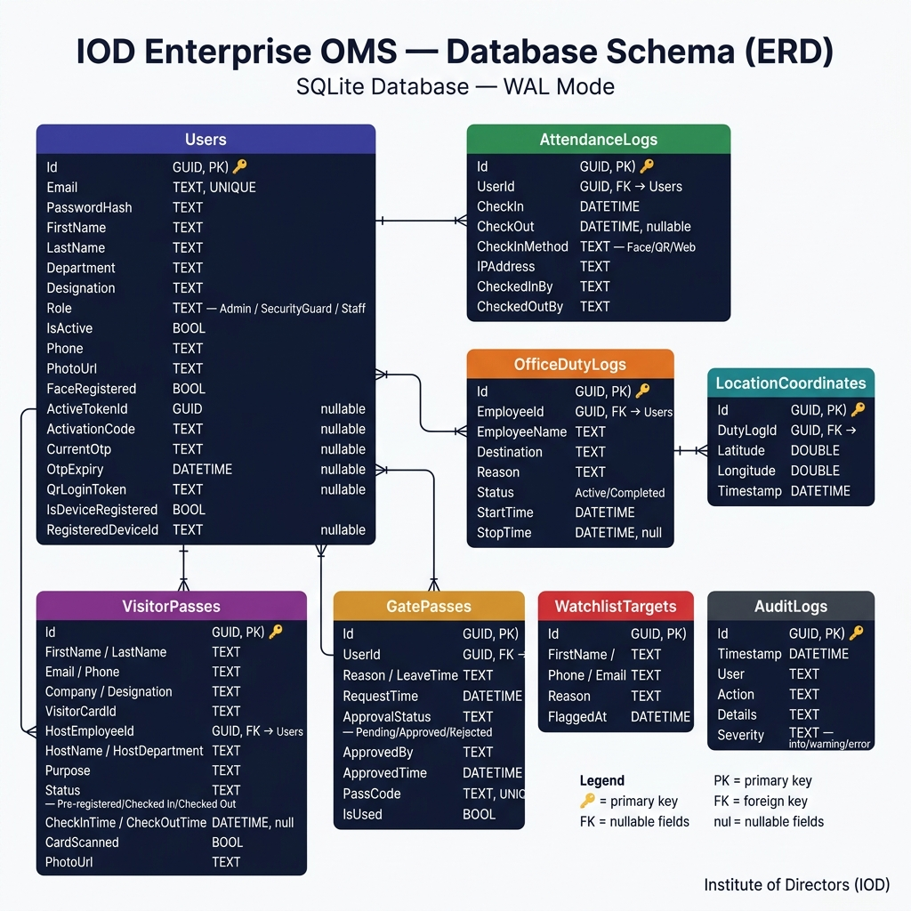

# Database Documentation

The Enterprise OMS uses **SQLite** running in **WAL (Write-Ahead Logging)** mode for high concurrency. This allows multiple readers (admin portal) to query the database while writers (mobile app location pings) continuously update records without lock contention.

---

## 📊 Database Schema Design

Below is the visual relational model of the IOD Enterprise Operations Management System:

---

## Core Schema Structure

### `Users`
Stores all Staff, Admins, and Security Guards.
- `Id` (TEXT / Guid): Primary Key
- `Email` (TEXT): Unique Identifier
- `PasswordHash` (TEXT): Encrypted Passwords
- `Role` (TEXT): Admin, Staff, SecurityGuard
- `ActiveTokenId` (TEXT / Guid): Tracks the current active JWT to enforce Single-Device login.

### `OfficeDutyLogs`
Tracks employees leaving the premises for official duties.
- `Id` (TEXT / Guid): Primary Key
- `EmployeeId` (TEXT / Guid): Foreign Key to `Users`
- `Status` (TEXT): Active, Completed
- `StartTime` (TEXT / DateTime), `StopTime` (TEXT / DateTime)

### `LocationCoordinates`
Stores raw GPS paths of active duties.
- `Id` (TEXT / Guid): Primary Key
- `DutyLogId` (TEXT / Guid): Foreign Key to `OfficeDutyLogs`
- `Latitude` (TEXT): **AES-256 Encrypted**
- `Longitude` (TEXT): **AES-256 Encrypted**
- `Timestamp` (TEXT / DateTime)

### `VisitorPasses`
Manages guest entry and exit.
- `Id` (TEXT / Guid): Primary Key
- `Company` (TEXT), `Purpose` (TEXT)
- `Status` (TEXT): Pre-registered, Checked In, Checked Out
- `HostEmployeeId` (TEXT / Guid): Foreign Key to `Users`

### `WatchlistTargets`
Flags individuals who require immediate security interception at the front desk.
- `Id` (TEXT / Guid)
- `FirstName` (TEXT), `LastName` (TEXT)
- `Reason` (TEXT): Justification for watchlisting.

### `AuditLogs`
Immutable security and action logs for compliance tracking.
- `Id` (TEXT / Guid)
- `User` (TEXT): Actor performing the action
- `Action` (TEXT), `Details` (TEXT), `Severity` (TEXT)

## Data Security Note
The `LocationCoordinates` table contains strictly confidential GPS paths of employees on duty. This data is physically stored in SQLite as encrypted `TEXT` blocks using `System.Security.Cryptography.Aes` natively inside Entity Framework Core's Value Converters (`HasConversion`).
